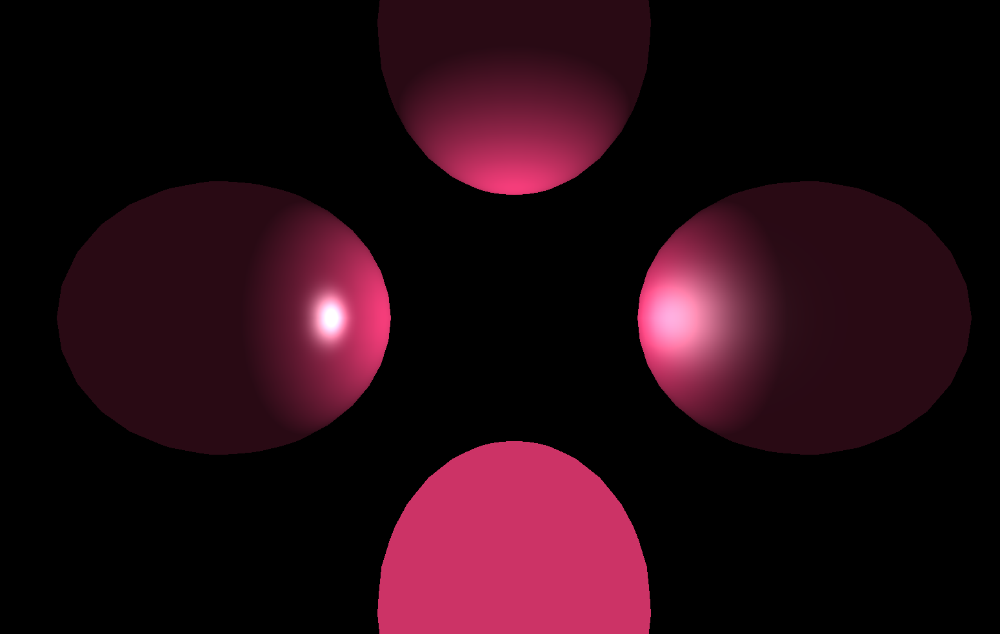
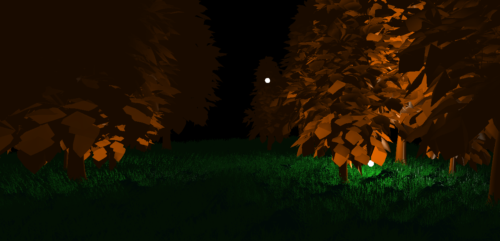

# ZPG 3D Graphics Engine


Welcome to the **OpenGL Graphics Render Engine**, a custom-built, 3D rendering engine developed in C++ and OpenGL. This project demonstrates basic computer graphics concepts, consisting of hierarchical transformations, lighting models and simulations, interactive scene management and much more.

## Gallery

*Here are a few glimpses of the engine in action:*


> *Demonstration of 4 simple light models.*


> *Forest Scene featuring dynamic point lights (fireflies) and flashlight spotlight.*


## Key Features & Capabilities

This engine was built from the ground up to better understad 3D graphics techniques. 

### Rendering & Lighting
*   **Multiple Lighting Models:** Implements Constant, Lambert, Phong, and Blinn-Phong shading models.
*   **Dynamic Lights:** Supports multiple simultaneous light sources, including:
    *   **Ambient Light:** Base scene illumination.
    *   **Directional Light:** Distant light sources like the Sun.
    *   **Point Lights:** Localized lights with attenuation (e.g., fireflies).
    *   **Spotlights (Reflectors):** Camera-attached flashlight interacting with the viewing direction.
*   **Materials:** Fully configurable material properties per object (Ambient, Diffuse, Specular reflection, and Shininess/Highlight).
*   **Texturing:** UV coordinate mapping for 2D textures (e.g., terrain, characters) and 3D Cubemap support for Skyboxes.
*   **Visibility Solving:** Utilizes Z-buffer (Depth testing) algorithms for rendering.

### Mathematics & Transformations
*   **Composite Transformations:** Implements the Composite design pattern for stacking affine transformations (Translation, Rotation, Scaling).
*   **Hierarchical Scene Graph:** Parent-child relationships (e.g., moons orbiting planets that orbit a sun) using local and global matricies.
*   **Parametric Curves:** 
    *   Dynamic movement along **Cubic Bezier Curves**.
    *   Advanced **Bezier Spline** support allowing seamless traversal across multiple continuous curve segments.

### Interactivity & Scene Management
*   **Object Picking:** Object selection using Stencil Buffer identification.
*   **UnProject Spatial Mapping:** Converts 2D mouse clicks on the screen into 3D world space coordinates (used for dynamic object spawning).
*   **Scene Factory:** Switch between completely isolated scenes (e.g., Whack-a-Mole, Forest, Solar System) at runtime.
*   **First-Person Camera:** Free-look camera system using mouse and WASD keyboard controls.

## Architecture

The code is written in C++ for objective oriented approach and shaders are written in GLSL.

### Design Patterns Used
*   **Observer:** Links the `Camera` and `Light` entities to the `Shader_program` so uniforms are updated automatically when view or lighting changes.
*   **Composite:** Used in the `Transformation_manager` to chain complex dynamic and static transformations.
*   **Singleton:** The `Resource_manager` ensures models, textures, and compiled shaders are only loaded into memory once and reused across entities.
*   **Factory:** `Scene_factory` abstracts the complex instantiation and assembly of different game scenes.

### Directory Structure

```text
├── include/                 # Header files (.h, .hpp)
│   ├── common/              # Global utilities and GLM wrappers
│   └── Transformations/     # Transformation class definitions
├── resources/               # Game assets
│   ├── models/              # .obj and .fbx 3D models
│   ├── objects/             # Complex prefabs (model + texture dirs)
│   ├── shaders/             # Vertex and Fragment GLSL shaders
│   └── textures/            # 2D images and cubemaps
└── src/                     # Source code (.cpp)
    ├── Transformations/     # Implementation of Matrix math & Bezier logic
    ├── Application.cpp      # Main loop
    ├── Camera.cpp           # View matrix and input handling
    ├── Controls.cpp         # Input state management
    ├── Drawable_object.cpp  # Renderable entity subclass
    ├── Entity.cpp           # Base class for all scene objects
    ├── Light.cpp            # Light entity subclass
    ├── Material.cpp         # Material property data struct
    ├── Model.cpp            # TinyOBJLoader wrapper and VBO/VAO setup
    ├── Resource_manager.cpp # Singleton asset cache
    ├── Scene.cpp            # Scene graph and entity lifecycle manager
    ├── Scene_factory.cpp    # Hardcoded scene setups
    ├── Shader_program.cpp   # GLSL compilation and uniform management
    ├── Spawner.cpp          # Logic for dynamic runtime object creation
    ├── Subject.cpp          # Observer pattern base class
    ├── Texture.cpp          # stb_image wrapper for OpenGL textures
    └── Transformation_manager.cpp # Composite transformation calculator
```

## Technologies Used

*   **C++17**
*   **OpenGL 3.3 Core Profile**
*   **GLFW3**
*   **GLEW**
*   **GLM**
*   **stb_image** 
*   **TinyOBJLoader**

## Getting Started

1. Clone the repository.
2. Ensure you have OpenGL, GLFW3, and GLEW installed on your system.
3. Configure the project using CMake.
4. Make a build folder
5. Run a Cmake
6. Run Make
7. Run Executable
8. Use `1`, `2`, `3`, `4` keys to switch between different scenes. Use `WASD` + `Mouse` to look around.